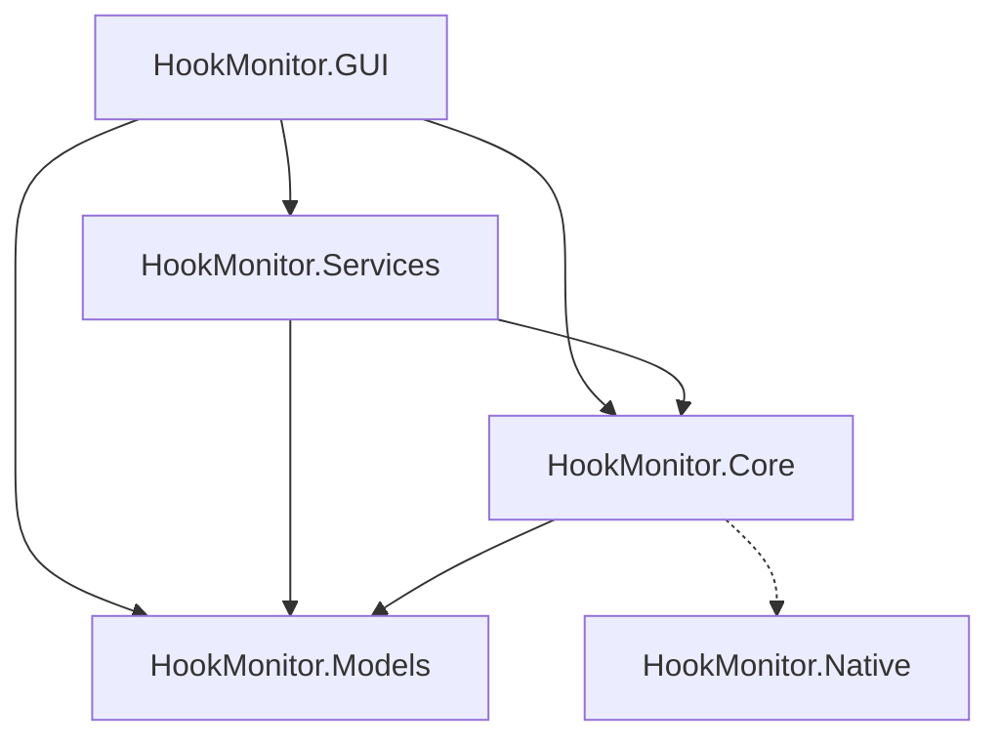

# HookMonitor 开发说明

面向二次开发与维护者。一般用户请看 [用户使用说明](用户使用说明.md)。仓库入口见 [README](../README.md)。

## 1. 项目目标与范围

**目标**：在 Ring3（用户态）检测可疑截屏、进程枚举及相关网络/注入痕迹，给出威胁评分与列表展示；兼容 Windows 11 + HVCI，默认不依赖驱动。

**范围内**：

- ETW 事件追踪、系统句柄扫描、可选 IAT Hook（注入式）
- 内核视角的被动检测：WFP、DNS、网络连接、LSP、DLL 注入、代理、驱动枚举等（只读，不改系统配置）
- WPF 桌面 UI（MVVM）与单元测试

**范围外**：内核驱动开发、主动阻断/杀毒处置、跨平台。

默认命名空间前缀：`Larpx.PersonalTools.HookMonitor.*`（由 `src/Directory.Build.props` 的 `RootNamespace` 统一）。

## 2. 解决方案结构

```text
WindowsHookTools/
├── src/
│   ├── Directory.Build.props
│   ├── HookMonitor.Models/      # 配置与数据模型
│   ├── HookMonitor.Core/        # ETW / 句柄 / Hook / Native 互操作 / 检测器
│   ├── HookMonitor.Services/    # 监控协调、威胁、进程信息
│   ├── HookMonitor.GUI/         # WPF 入口与界面
│   ├── HookMonitor.Native/      # 原生 C DLL（IAT Hook 代理）
│   └── HookMonitor.Tests/       # 单元测试
├── docs/
├── scripts/
├── WindowsHookTools.slnx
├── README.md
└── LICENSE
```



`WindowsHookTools.slnx` 收录托管工程；Native 为 C 工程，通过 `scripts/build-native.ps1` 或 `src/HookMonitor.Native/build.bat` 单独编译。

## 3. 环境 / 构建 / 运行

| 项 | 要求 |
|----|------|
| SDK | .NET 10 |
| IDE | Visual Studio 2022 较新版本，或 VS Code + C# Dev Kit |
| Native（可选） | MSVC / x64 Native Tools；仅 IAT Hook 需要 |

```bash
dotnet restore
dotnet build --configuration Release
dotnet run --project src/HookMonitor.GUI --configuration Release
dotnet test src/HookMonitor.Tests
```

Native DLL：

```powershell
.\scripts\build-native.ps1
# 或
.\scripts\build-native.ps1 -MsBuild
```

必须以管理员身份运行 GUI，否则 ETW / 句柄扫描不可用。

## 4. 配置要点与护栏

配置文件：`src/HookMonitor.GUI/appsettings.json`，节名 `MonitorConfig`，绑定到 `MonitorConfig` 模型。

要点：

- 默认：`EnableEtw` / `EnableHandleScan` / 行为分析开启；`EnableIatHook` 默认关闭
- 阈值：`ThreatThreshold`、进程枚举/截屏频率阈值等
- 白名单 / 黑名单进程名列表可扩展
- 本地覆盖文件 `appsettings.Development.json` / `appsettings.Local.json` 已在 `.gitignore`，勿提交机密

护栏（注入相关）：

- 关键进程、安全软件进程、PPL、自身进程、过低 PID 等禁止注入
- IAT Hook 仅改导入表数据段，避免触碰代码段以兼容 HVCI
- 检测组件以被动读取为主，不写系统配置

## 5. UI 与扩展入口

| 入口 | 位置 | 说明 |
|------|------|------|
| DI 注册 | `App.ConfigureServices` | 注册 `MonitorConfig`、进程/威胁/监控服务 |
| 主 VM | `MainViewModel` | 开始/停止、列表与状态绑定 |
| 监控编排 | `MonitoringService` | 协调 ETW、句柄、可选 Hook 管道与内核视角检测器 |
| 威胁聚合 | `ThreatDetectionService` | 可疑进程增删改与评分侧逻辑 |
| 关键进程表 | `CriticalProcessProvider` | 注入黑名单与合法进程减分依据 |
| 新增检测器 | `HookMonitor.Core/Monitoring` | 在 `MonitoringService` 中挂接并读配置开关 |

扩展建议：新检测逻辑优先落在 Core，经 Services 汇入 UI；配置项加到 `MonitorConfig` 并在 `appsettings.json` 给出默认值。

## 6. 测试与覆盖约定

- 测试工程：`src/HookMonitor.Tests`（xUnit）
- 当前覆盖：`CriticalProcessProvider`、`DllInjector` 安全检查、部分 Models、`ThreatDetectionService` 基本行为
- 约定：改安全护栏或威胁聚合时补/改对应单测；涉及原生/需管理员的路径可用手工验证，不强行在 CI 做注入实测

```bash
dotnet test src/HookMonitor.Tests
```

## 7. 整改 / 演进脉络

| 阶段 | 摘要 |
|------|------|
| 早期 | 用户态截屏/进程枚举监控，ETW + 句柄 + 可选 IAT Hook |
| 增强 | 配置系统、进程架构与监控逻辑优化；IAT / 注入器改进 |
| 内核视角 | 增加 WFP、DNS、连接、LSP、注入、代理等被动检测 |
| 仓库规范 | 工程已在 `src/`；统一 `Larpx.PersonalTools.HookMonitor.*`；补齐 docs / scripts / ignore / README 入口 |

## 8. 目录约定

| 目录 | 内容 |
|------|------|
| `src/` | 全部业务与测试工程（含 Native 源码） |
| `docs/` | 用户/开发 Markdown 文档 |
| `scripts/` | 运维与构建脚本（如 `build-native.ps1`） |
| `Models/` | 大体量模型文件（默认不入库） |
| `other/` | 仅真正杂项；本仓当前未使用 |

## 9. 开发侧 FAQ

| 问题 | 处理 |
|------|------|
| 命名空间不一致 | 以 `src/Directory.Build.props` 为准，前缀 `Larpx.PersonalTools.` |
| Native 编译失败 | 使用 VS x64 Native Tools；确认 `cl.exe` 可用；先看 `build.bat` 输出 |
| GUI 无 ETW 数据 | 确认管理员权限与 `EnableEtw` |
| 双远程怎么推 | `origin`：Gitee fetch + push，并配置 GitHub 为附加 pushurl；日常 `pull` 只走 Gitee |

## 10. 文档索引

| 文档 | 职责 |
|------|------|
| [用户使用说明](用户使用说明.md) | 面向最终用户 |
| [开发说明](开发说明.md) | 本文 |
| [README](../README.md) | 仓库入口 |
| [README.en.md](../README.en.md) | 英文精简入口 |
| [LICENSE](../LICENSE) | MIT |
